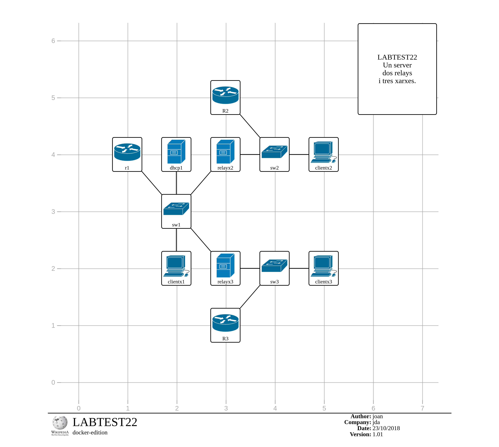

# labtest022
## servidor dhcp dnsmasq >> isc-dhcp (migració)- tres xarxes + configuració del hostname
[]
#### la novetat respecte al primer lab (lab01) és que ara configurem un únic servidor d'adreces ip (dhcpserver) per a cada subxara que volem gestionar (2 en aquest cas). El servidor de relleu/reenviament (dhcprelay) rep les peticions dels clients de la 2ona subxarxa i les ha de traspassar (les peticions) al servidor (únic) que ho gestiona tot. La part important és que el servidor (dhcpserver) ha de saber per on enviar les respostes (establiment de ruta estàtica al fitxer de post-configuració (up.sh)).

### Per a la realització d'aquests labs (dhcp) i atés que docker assigna una ip de manera automàtica als contenidors associats a una xarxa, farem servir el següent hack

- se crea una xarxa (paràmetre subnet)
- se limiten el nombre de ips a repartir (/30 - és la màscara habitual en una xarxa punt a punt: sols hi ha dues adreces disponibles de les 4 possibles, doncs la 1era especifica la xarxa i l'última l'adreça de difusió. Se bloquegen les ips disponibles, inclosa la de difusió - que a docker també és hàbil (a data 20180801). S'assignen de manera manual les ips als contenidors. Se sol·licita una ip al servidor, fent que aparega una segona ip assignada del rang. Opcional: si s'alliberen les ips, s'alliberen totes dues i si se torna a demanar, ara ja s'assignarà una única ip.)

## execució del lab:
### ./up.sh

- comprovar els dos contenidors 
  -- docker exec -it dhcpclientx2 bash
    --- ip a
    --- exit

### ./down.sh

- proves a efectuar: 
-- posar clients també de la xarxa 1
-- fer la traça dels paquets que s'envien amb tcpdump / wireshark
-- crear més containers que interval
-- provar d'assignar ip + passarel·la + dns server

- fitxers a observar:
  -- en el servidor: 
    --- ips assignades
  -- en el client:
    --- període de concesió de la ip

- ampliacions:
  -- portar el control centralitzat de les ips assignades (IPAM - phpipam vs opennetadmin)

